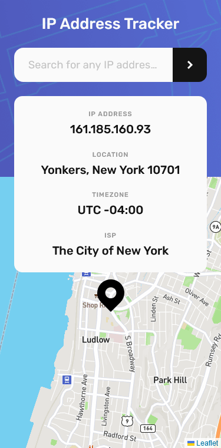

# Frontend Mentor - IP address tracker solution

This is a solution to the [IP address tracker challenge on Frontend Mentor](https://www.frontendmentor.io/challenges/ip-address-tracker-I8-0yYAH0).

I used [ipwhois.io](https://ipwhois.io/) for geolocation instead of the recommended [geo.ipify.org](https://geo.ipify.org/) because it has a much higher request threshold (x10000/month).
It means that the app only allows geolocation by IP Address, and not by domain name.

## Table of contents

- [Overview](#overview)
  - [The challenge](#the-challenge)
  - [Screenshot](#screenshot)
  - [Links](#links)
- [My process](#my-process)
  - [Built with](#built-with)
  - [What I learned](#what-i-learned)
  - [Continued development](#continued-development)
  - [Useful resources](#useful-resources)
- [Author](#author)

## Overview

### The challenge

Users should be able to:

- View the optimal layout for each page depending on their device's screen size
- See hover states for all interactive elements on the page
- See their own IP address on the map on the initial page load
- Search for any IP addresses or domains and see the key information and location

### Screenshot

- Desktop (1440x800)


- Mobile (375x760)



### Links

- Solution URL: [Add solution URL here](https://your-solution-url.com)
- Live Site URL: [https://ip-address-tracker-mu-silk.vercel.app/](https://ip-address-tracker-mu-silk.vercel.app/)

## My process

### Built with

- Semantic HTML5 markup
- CSS custom properties
- CSS Grid
- CSS Flexbox
- Mobile-first workflow
- [SASS/SCSS](https://sass-lang.com/)
- [Typescript](https://www.typescriptlang.org/)
- [Vitejs](https://vitejs.dev/)
- [ipwhois](https://ipwhois.io/)
- [Leaflet](https://leafletjs.com/)
- [Mapbox](https://www.mapbox.com/)

### What I learned

#### SASS/SCSS

It is the first time i've ever used SCSS to write my styles. Before, I used CSS, tailwind and various CSS in Js libraries.
I will 100% use it again. It is so nice! I loved everything about it such as:

- Code splitting with partials

You create a **\_filename.scss** and import it with the **@use** directive:

```scss
@use "variables" as *; // Imports _variables.scss
@use "reset";
@use "utilities";
```

`@use "variables" as *` lets you use the variables without calling their namespace like `background-color: $clr-white` instead of `background-color: variables.$clr-white`.

- Nested classes & MediaQueries

```scss
.header {
  height: 18.75rem;
  padding: 1.5rem;
  background: $clr-accent url("../assets/pattern-bg.png") no-repeat center;
  background-size: cover;

  &-title {
    margin-bottom: 1.5rem;
    color: $clr-white;
    font-weight: $fw-medium;
    text-align: center;
    font-size: $fs-xl;
  }

  /** A variable used as the min-width in the mediaquery 😉 **/
  @media (min-width: $screen-md) {
    height: 17.5rem;
    padding: 1.75rem;

    &-title {
      font-size: $fs-2xl;
      margin-bottom: 1.75rem;
    }
  }
}
```

#### Additional CSS Reset rules

I added some new properties in my usual reset for users with the prefers-reduced-motion setting.

```css
/* Remove all animations, transitions and smooth scroll for people that prefer not to see them */
@media (prefers-reduced-motion: reduce) {
  html:focus-within {
    scroll-behavior: auto;
  }

  *,
  *::before,
  *::after {
    animation-duration: 0.01ms !important;
    animation-iteration-count: 1 !important;
    transition-duration: 0.01ms !important;
    scroll-behavior: auto !important;
  }
}
```

It comes from the article [A Modern CSS Reset](https://piccalil.li/blog/a-modern-css-reset/) by [Andy Bell](https://github.com/hankchizljaw/).

### Continued development

I plan to create a toggle button to be able to hide the results panel because it takes a significant portion of the screen especially on mobile.

### Useful resources

- [Vitejs](https://vitejs.dev/) - Js Dev server & code bundler.
- [A Modern CSS Reset](https://piccalil.li/blog/a-modern-css-reset/) - Blog article by [Andy Bell](https://github.com/hankchizljaw/).
- [ipwhois.io](https://ipwhois.io/) - Fast and accurate IP Geolocation API with a massive free tier (x10000 requests/month).
- [Leaflet](https://leafletjs.com/) - Open-source JavaScript library for mobile-friendly interactive maps.
- [Mapbox](https://www.mapbox.com/) - A large choice of map styles with a good free tier and URL restricted api_tokens.
- [Heroicons](https://heroicons.com/) - Beautiful hand-crafted SVG icons, by the makers of Tailwind CSS.

## Author

- Frontend Mentor - [@yourusername](https://www.frontendmentor.io/profile/yourusername)
